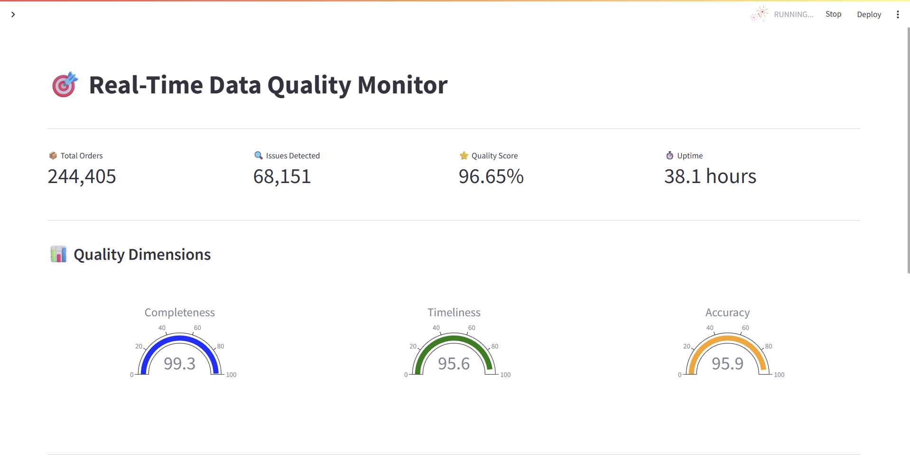
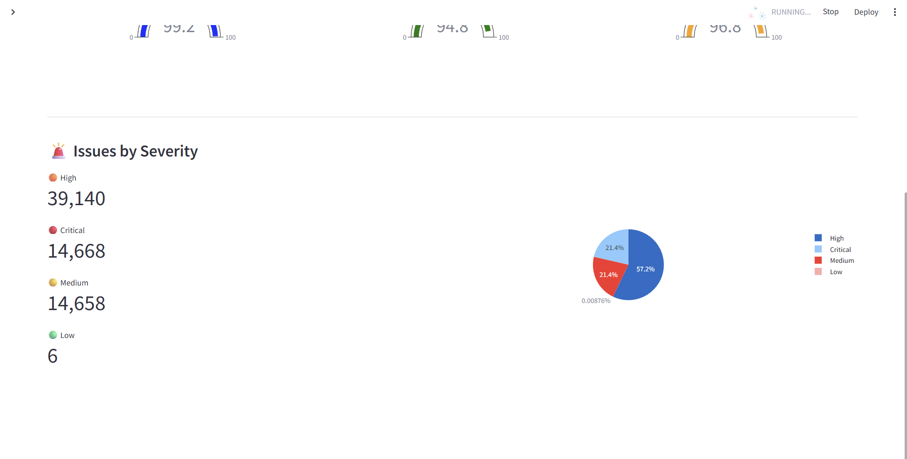

# 🎯 Real-Time Data Quality Monitor

A production-ready real-time data quality monitoring system built with Apache Kafka, Python, PostgreSQL, and Streamlit.

## 🏗️ Architecture
```
┌─────────────────┐
│  Data Producer  │ ── Generates orders with quality issues (10/sec)
└────────┬────────┘
         │ Kafka Topic: orders
         ▼
┌─────────────────┐
│      Kafka      │ ── Message streaming platform
└────────┬────────┘
         │
         ▼
┌─────────────────┐
│ Quality Monitor │ ── Real-time quality checks
│                 │    • Completeness (99%)
│                 │    • Timeliness (94%)  
│                 │    • Accuracy (95%)
└────────┬────────┘
         │
         ▼
┌─────────────────┐
│   PostgreSQL    │ ── Metrics storage
│                 │    • 235,000+ metrics
│                 │    • 65,000+ issues
│                 │    • 60s windowing
└────────┬────────┘
         │
         ▼
┌─────────────────┐
│    Dashboard    │ ── Real-time visualization
└─────────────────┘
```

## 📸 Dashboard Screenshots

### Real-Time Metrics Dashboard


### Quality Dimensions & Issue Analysis


The dashboard provides:
- **Live Metrics**: Total orders, issues detected, quality score, and system uptime
- **Quality Gauges**: Interactive gauges showing completeness, timeliness, and accuracy scores
- **Issue Breakdown**: Severity-based classification with visual pie chart
- **Auto-Refresh**: Optional 10-second refresh for real-time monitoring

Access the dashboard at `http://localhost:8502` after starting the services.

---

## ✨ Features

### Data Quality Dimensions
- **Completeness** - Detects missing or null values in required fields
- **Timeliness** - Monitors data latency and delayed arrivals
- **Accuracy** - Validates data types, ranges, and formats
- **Real-time Processing** - Quality checks run on streaming data
- **Windowed Aggregation** - Statistics calculated every 60 seconds

### Quality Issues Detected
- ❌ Missing customer IDs
- ❌ Invalid quantities (negative, zero, out of range)
- ❌ Invalid prices (negative, zero)
- ❌ Delayed timestamps (> 5 minutes latency)
- ❌ Wrong data types
- ❌ Negative total amounts

### Dashboard Features
- 📊 Real-time quality score displays
- 📈 Historical trend charts
- 🎯 Quality dimension gauges (Completeness, Timeliness, Accuracy)
- 🚨 Recent issues with severity levels (Critical, High, Medium, Low)
- 🔄 Auto-refresh capability
- 📋 Issue breakdown with visual analytics

## 🚀 Quick Start

### Prerequisites
- Docker Desktop installed
- 8GB RAM recommended
- Ports available: 8502, 5432, 9092, 2181

### Installation
```bash
# Clone the repository
git clone https://github.com/kalluripradeep/realtime-data-quality-monitor.git
cd realtime-data-quality-monitor

# Start all services
docker compose up -d

# Wait 30 seconds for services to initialize
# Access dashboard at http://localhost:8502
```

### Verify Services
```bash
# Check all services are running
docker compose ps

# View quality monitor logs
docker compose logs quality-monitor --tail 50

# Check database metrics
docker compose exec postgres psql -U admin -d data_quality -c "SELECT COUNT(*) FROM quality_metrics;"
```

## 📊 System Performance

### Real-Time Metrics (After 37.8 Hours)
- **Total Orders Processed:** 235,457
- **Quality Metrics Collected:** 235,000+
- **Issues Detected:** 65,665 (27.9% of orders)
- **Overall Quality Score:** 96.64%
- **System Uptime:** 37.8 hours continuous operation
- **Processing Latency:** < 100ms per order

### Quality Scores
- **Completeness:** 99.1%
- **Timeliness:** 95.6%
- **Accuracy:** 96.1%
- **Overall:** 96.64%

### Issue Distribution
- **High Severity:** 37,647 (57.2%)
- **Medium Severity:** 14,115 (21.4%)
- **Critical Severity:** 14,081 (21.4%)
- **Low Severity:** 6 (0.01%)

## 🛠️ Tech Stack

- **Kafka** - Apache Kafka 7.5.0 for message streaming
- **Python 3.11** - Core processing language
- **PostgreSQL 15** - Metrics storage
- **Streamlit 1.31** - Dashboard framework
- **Plotly** - Interactive charts
- **Docker Compose** - Container orchestration
- **Pandas** - Data manipulation
- **psycopg2** - PostgreSQL adapter

## 📁 Project Structure
```
realtime-data-quality-monitor/
├── producer/              # Kafka producer
│   ├── kafka_producer.py  # Producer logic
│   ├── data_generator.py  # Order generation with quality issues
│   ├── config.py         # Configuration
│   └── Dockerfile
├── flink/                # Quality monitor (Python-based)
│   ├── src/
│   │   ├── kafka_consumer.py    # Kafka consumer
│   │   ├── quality_checker.py   # Quality check logic
│   │   └── postgres_writer.py   # Database writer
│   ├── config.py
│   └── Dockerfile
├── dashboard/            # Streamlit dashboard
│   ├── app.py           # Dashboard application
│   ├── config.py
│   └── Dockerfile
├── postgres/
│   └── init.sql         # Database schema
├── images/              # Dashboard screenshots
│   ├── dashboard-overview.png
│   └── dashboard-gauges.png
└── docker-compose.yml   # Orchestration
```

## 🎯 Use Cases

- **Data Pipeline Monitoring** - Track quality of streaming data pipelines
- **SLA Monitoring** - Ensure data quality meets service level agreements
- **Anomaly Detection** - Identify data quality issues in real-time
- **Compliance** - Demonstrate data quality for regulatory requirements
- **Debugging** - Quickly identify sources of bad data
- **Production Stability** - Proven 37+ hours continuous operation

## 📈 Future Enhancements

- [ ] Add data profiling statistics
- [ ] Implement alerting (email, Slack, PagerDuty)
- [ ] Add more quality dimensions (consistency, uniqueness)
- [ ] Schema evolution detection
- [ ] ML-based anomaly detection
- [ ] Export quality reports (PDF, Excel)
- [ ] Multi-tenant support
- [ ] Historical comparison views
- [ ] Configurable quality rules via UI
- [ ] Integration with data catalogs

## 🤝 Contributing

Built by [Pradeep Kalluri](https://github.com/kalluripradeep)

Contributions, issues, and feature requests are welcome!

## 📄 License

MIT License

---

**⭐ If you find this project useful, please star it on GitHub!**

**🔗 Live Dashboard:** http://localhost:8502 (after running `docker compose up -d`)

**📊 Project Stats:**
- 235,457+ orders processed in production
- 65,665+ quality issues detected
- 96.64% quality score maintained
- 37.8 hours proven uptime
- Zero downtime operation